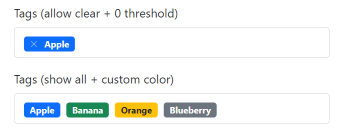

# Tags for Bootstrap 4/5

[](https://nodei.co/npm/bootstrap5-tags/) 
[](https://www.npmjs.com/package/bootstrap5-tags)

## How to use

An ES6 native replacement for `select` using standards Bootstrap 5 (and 4) styles.

No additional CSS needed! Supports creation of new tags.

```js
import Tags from "./tags.js";
Tags.init();
// Tags.init(selector, opts);
```

By default, only provided options are available. Validation error
will be displayed in case of invalid tag.

```html
<label for="validationTags" class="form-label">Tags</label>
<select class="form-select" id="validationTags" name="tags[]" multiple>
    <option disabled hidden value="">Choose a tag...</option>
    <option value="1" selected="selected">Apple</option>
    <option value="2">Banana</option>
    <option value="3">Orange</option>
</select>
<div class="invalid-feedback">Please select a valid tag.</div>
```

Use attribute `data-allow-new` to allow creation of new tags. Their
default value will be equal to the text. Since you can enter
arbitrary text, no validation will occur.

```html
<select class="form-select" id="validationTags" name="tags[]" multiple data-allow-new="true">
```

Use attribute `data-show-all-suggestions` in order to show an unfiltered list of options.
Only the first matching value is selected.

```html
<select class="form-select" id="validationTags" name="tags[]" multiple data-show-all-suggestions="true">
```

Use attribute `data-allow-clear` in order to add a cross to remove items.

```html
<select class="form-select" id="validationTags" name="tags[]" multiple data-allow-clear="true">
```

Use attribute `data-suggestions-threshold` to determine how many characters need to be typed to show the dropdown (defaults to 1).

```html
<select class="form-select" id="validationTags" name="tags[]" multiple data-suggestions-threshold="0">
```

Use attribute `data-validate-regex` to do a regex validation. Not matching tags are getting a warning color. This color can be defined with `data-warning-badge-style`.

```html
<select class="form-select" id="validationTags" name="tags[]" multiple data-validate-regex=".*@mycompany\.com$" data-warning-badge-style="warning">
```

Use attribute `data-validate-new` together with `data-validate-regex` to only allow new tags, when they match the given regex. Not matching tags cannot be added and it shows the invalid feedback. 

```html
<select class="form-select" id="validationTags" name="tags[]" multiple data-validate-new="true" data-validate-regex=".*@mycompany\.com$">
```

*NOTE: don't forget the [] if you need multiple values!*

## Server side support

You can also use options provided by the server. This script expects a json response that is an array or an object with the data key containing an array.

Simply set `data-server` where your endpoint is located. It should provide an array of value/label objects. The suggestions will be populated upon init
except if `data-live-server` is set, in which case, it will be populated on type. A ?query= parameter is passed along with the current value of the searchInput.

```html
<label for="validationTagsJson" class="form-label">Tags (server side)</label>
    <select class="form-select" id="validationTagsJson" name="tags_json[]" multiple data-allow-new="true" data-server="demo.json" data-live-server="1">
    <option disabled hidden value="">Choose a tag...</option>
</select>
```

## Accessibility

You can set accessibility labels when passing options:
- clearLabel ("Clear" by default)
- searchLabel ("Type a value" by default)

## Tips

- Use arrow down to show dropdown (and arrow up to hide it)
- If you have a really long list of options, a scrollbar will be used

## Bootstrap 4 support

Even if it was not the initial idea to support Bootstrap 4, this component is now compatible with Bootstrap 4 because it only
requires minimal changes.

Check out demo-bs4.html

## Demo

https://codepen.io/lekoalabe/pen/ExWYEqx

## How does it look ?



## I need more

Maybe you can have a look at https://github.com/Honatas/multi-select-webcomponent